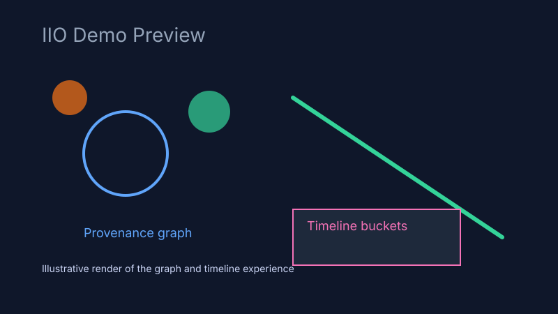

# Information Integrity Observatory Demo

The Information Integrity Observatory (IIO) reveals where narratives originate and how they spread. It traces provenance, transformations, and propagation across news, social, blog, and document channels—**never judging truthfulness**, only showing lineage and diffusion.



## Quick start

### Codespaces
1. Open this repository in GitHub Codespaces.
2. Wait for the post-create tasks to finish (Python + Node deps install automatically).
3. Start the dev servers:
   ```bash
   make dev
   ```
4. In a new terminal, load the curated narratives:
   ```bash
   make seed
   ```
5. Open the frontend at http://localhost:5173 (backend docs at http://localhost:8000/docs).

### Local environment
1. Ensure Python 3.11+, Node 20+, and pnpm are installed.
2. Install dependencies:
   ```bash
   pip install -e .[dev]
   cd frontend && pnpm install && cd ..
   ```
3. Run both servers:
   ```bash
   make dev
   ```
4. Seed sample data via `make seed`.

## Repository tour

```
backend/    # FastAPI app, similarity pipeline, websocket hub
frontend/   # React + Vite UI with D3 graph + timeline visualizations
data/       # Narrative seeds across three storylines
.devcontainer/ # Codespaces setup
```

## API reference

| Method & Path | Description |
| --- | --- |
| `POST /api/ingest/url` | Fingerprint a fetched URL and emit provenance edges |
| `POST /api/ingest/text` | Ingest raw text (with optional source/channel metadata) |
| `GET /api/graph/graph` | Return current nodes + edges for visualization |
| `GET /api/graph/node/{id}` | Retrieve node metadata, claims, and adjacent edges |
| `GET /api/graph/search?q=keyword` | Case-insensitive search across text and claims |
| `GET /api/graph/timeline` | Buckets of ingested items per day |
| `GET /api/graph/origin/{id}` | Earliest known ancestor(s) by timestamp |
| `GET /api/graph/trace/{id}` | Shortest provenance path from origin to node |
| `POST /api/graph/simulate` | Run R0-based diffusion simulation for a node |
| `GET /api/ingest/seed/load` | Load narrative seed set (idempotent) |
| `WS /ws` | Stream node/edge/metric events to the UI |

### Example requests

```bash
curl -X POST http://localhost:8000/api/ingest/text \
  -H 'Content-Type: application/json' \
  -d '{"text":"Aurora council says river nitrate levels will normalize by Saturday.","source_name":"Aurora Wire","channel":"news"}'

curl "http://localhost:8000/api/graph/search?q=nitrate"

curl -X POST http://localhost:8000/api/graph/simulate \
  -H 'Content-Type: application/json' \
  -d '{"id":"node-aurora-alert","r0":1.4,"weights":{"news":1,"social":2,"blog":1,"pdf":0},"steps":3}'
```

## Similarity heuristics

Relation labels depend on TF-IDF cosine + shingle Jaccard scores:

- **quote**: quoted span overlap ≥ 70% with ≥ 20 shared tokens
- **near-duplicate**: cosine ≥ 0.80
- **paraphrase**: cosine ≥ 0.45 and Jaccard ≥ 0.25
- **summary**: cosine ≥ 0.35 with new text ≤ 60% of ancestor length
- **reference**: explicit link to ancestor URL

Tune thresholds via environment variables (`IIO_PARAPHRASE_THRESHOLD`, `IIO_NEAR_DUPLICATE_THRESHOLD`, etc.) or edit `backend/app/config.py`.

## Optional Neo4j graph store

1. Enable the `neo4j` profile in Docker Compose:
   ```bash
   docker compose --profile graph up
   ```
2. Set environment variables before launching the backend:
   ```bash
   export IIO_NEO4J_URI=bolt://localhost:7687
   export IIO_NEO4J_USER=neo4j
   export IIO_NEO4J_PASSWORD=password
   ```
3. Implement the adapter in `backend/app/core/store.py` to forward node/edge writes (scaffold included).

## Testing & linting

```bash
make test     # pytest + vitest
make fmt      # black + ruff + prettier
make lint     # lint only
```

## Credits & license

MIT Licensed. Seed narratives are fictional composites created for this demo.
