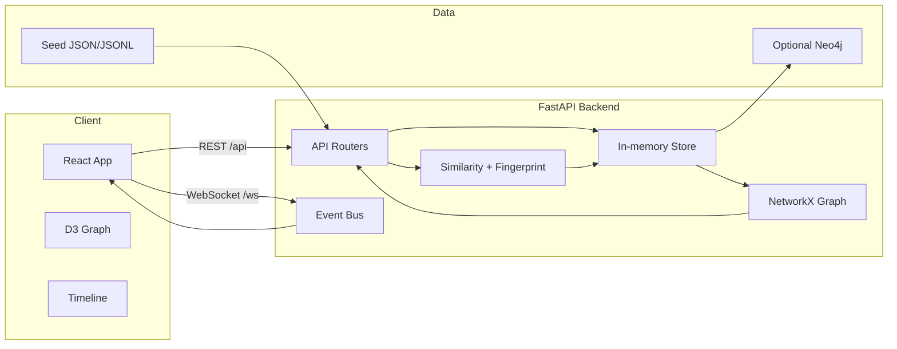

# Architecture

The frontend requests the initial graph and timeline data via REST and maintains live updates from the event bus over WebSockets. Ingestion flows fingerprint text with shingling + MinHash, evaluates similarity, and persists nodes/edges in the in-memory store while also updating the NetworkX graph representation.
